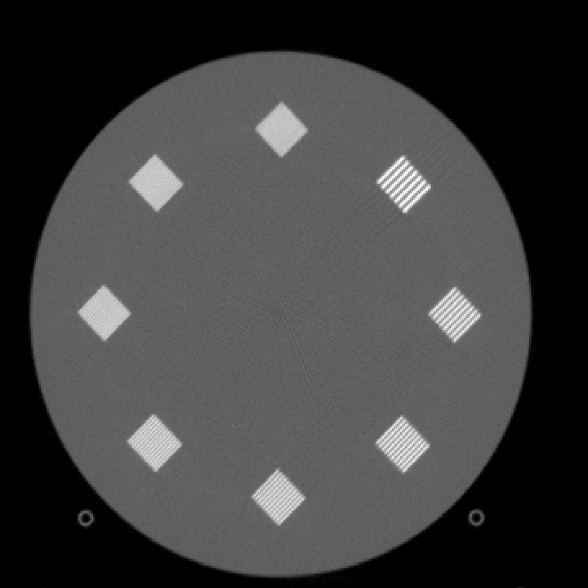

# Overview

This project includes a CUDA-based implementation of an iterative algebraic reconstruction algorithm for X-ray computed tomography (CT) data. Specifically, this implementation supports the data sets available via the Cancer Imaging Archive (TCIA) as part of the Low Dose CT and Projection Imaging data set (https://wiki.cancerimagingarchive.net/pages/viewpage.action?pageId=52758026). These data sets use a DICOM-based data format (DICOM-CT-PD) to store the partially processed projection data -- see the DICOM-CT-PD manual (https://wiki.cancerimagingarchive.net/download/attachments/52758026/DICOM-CT-PD%20User%20Manual_Version%203.pdf?api=v2) for details.

This project is intended to provide a development environment for optimizing the GPU-based forward and backprojection operators and not to generate imagery with improved image quality. Thus, its goal is not to be a practical reconstruction framework. The currently implemented algorithm is a modified version of the Simultaneous Iterative Reconstruction Technique (SIRT) and the projector model is line intersection based. If the goal is to improve image quality for low dose scans, then a statistical iterative reconstruction algorithm and a more sophisticated forward model would be more typical.

# Dependencies and Requirements

Dependencies include CMake (3.23+), CUDA, Boost (only the `program_options` library), and DCMTK (`libdcmtk-dev` in Ubuntu). To date, this code has been developed on Ubuntu 22.04 with CUDA 12, although other reasonably new Linux distributions should work as well. For Ubuntu, new versions of CMake are available via Kitware's APT repository (https://apt.kitware.com). The new version of CMake is only required to default to building the CUDA kernels for the GPUs installed on the system where the software is being built. The architecture can also be specified explicitly using e.g. `CUDAARCHS=86 make` to build for compute capability 8.6. In that case, the CMake minimum version can be dropped to 3.18.

# Algorithm and Model Details

The currently implemented reconstruction algorithm is PSIRT (Parallel Simultaneous Iterative Reconstruction Technique), which includes modifications to the standard SIRT algorithm provided in [1] and [2].
In addition, the implementation supports ordered subsets, so the algorithm can be termed OS-PSIRT-N where N is the number of subsets. PSIRT is similar to SIRT, but a specifically chosen scalar is used in place of per-voxel weighting used in SIRT. This significantly decreases the amount of memory needed, especially when combined with ordered subsets.

## Reconstruction Algorithm

The implemented algorithm is OS-PSIRT-N, which is a modified version of the standard SIRT algorithm. SIRT is given by the following update equation:

$x^{k+1} = x^{k} + C A^T R(b - A x^{k})$

where $x^{k}$ is the $k$-th image, $C$ is a diagonal matrix of the inverse column sums of $A$, $R$ is a diagonal matrix of the inverse row sums of $A$, $b$ is the projection data, and $A$ is the system matrix defined by the projection model. This converges to the weighted least squares solution $\| Ax - b \|_R^2$.

Adding subsets yields a modified version where each subset $s$ yields a version of $C$, $A$, $R$, and $b$ that correspond to the reduced set of rows of $A$ used for subset $s$:

$x^{k+1} = x^{k} + C_s A^T_s R_s(b_s - A_s x^{k})$

This version is problematic because we now have $N$ volume-sized matrices $C_0, C_1, ..., C_{N-1}$ that we either need to store or fully recompute for each subset and iteration.

The modified version of SIRT replaces $C_s$ with the inverse of the maximum column sum of $A_s$, which is shown in [1] to still converge to the same result. Note that the maximum column sum of $A$ is the 1-norm, i.e. $\| A \|_1$. PSIRT further modifies this approach by applying a scalar of $2/(1+\epsilon)$ where $\epsilon$ is small [2].

We thus have the following final update equation:

$x^{k+1} = x^{k} + \alpha_s A^T_s R_s(b_s - A x^{k})$

where $\alpha_s = \frac{2}{(1+\epsilon)\| A_s \|_1}$.

## Projection Model

The forward model is a ray-driven line intersection based model as described in [3]. While this is not a state-of-the-art model, it does generate high-quality forward projections, especially when combined with ray oversampling (not currently implemented). However, the ray-driven model is relatively difficult to optimize for GPUs for a few reasons. The calculations described in [3] essentially "follow" a line through the voxel space, accounting for each intersection with a voxel. However, the most natural mapping to a GPU implementation is to map threads to projection rays -- this means that there is inherent divergence in the operations performed by each thread in a warp. Furthermore, during backprojection, mapping threads to projection rays means that many threads will update the same voxel (i.e. many rays can intersect a single voxel). This requires atomic updates to voxels during backprojection, which can impact performance. Note that it is an option to perform the updates non-atomically and accept that there will be some missing updates due to the write hazards introduced when multiple threads update the same location. There is an argument to be made that iterative algorithms will self-correct in such circumstances, but this project takes it as an assumption that any potential write hazards should be prevented.

## Output Image Units / Format

The reconstruction is performed in the x-ray linear attenuation coefficient space using single precision floating point arithmetic. For example, water will reconstruct as roughly 0.02 cm^-1. The reconstructed units are then converted to Hounsfield units using the WaterAttenuationCoefficient field in the DICOM-CT-PD files. The linear attenuation coefficient of water is energy dependent and thus it can vary per-scan and depending on the pre-processing and calibration factors. The conversion to Hounsfield units is given by HU = 1000 * (mu - mu_water) / mu_water where mu is the reconstructed voxel value and mu_water is the linear attenuation coefficient of water stored in the WaterAttenutationCoefficient DICOM-CT-PD field.

The Hounsfield units are then rounded to the nearest integral value, clamped to the range [-32768, 32767], and finally stored as signed int16 values. In Hounsfield units, air is -1000 and water is 0. Note that it is common in some other formats to add a bias of at least 1000 and store the resulting value as uint16 values (this adds dynamic range on the high-attenuation end while adding the reasonable assumption that nothing has lower attenuation coefficients than open air).

# Data Sets

The data sets used for this work are available via the Cancer Imaging Archive (TCIA) as part of the Low Dose CT and Projection Imaging data set (https://wiki.cancerimagingarchive.net/pages/viewpage.action?pageId=52758026). On that page is a link to a box.com location with some sample data sets in DICOM-CT-PD format. Note that many more data sets are available if the user submits a request for a license agreement. However, this work has thus far only used the openly available data (and not the TCIA Restricted data set). In particular, I have thus far only worked with the ACR Phantom scan and scan L286 from the training projection data set.

# Building the Code

This project uses CMake, but it also includes a top-level `Makefile`, so if all dependencies are installed, then simply running `make` should be sufficient. By default, the build directory is `build-release` and the compiled executable is `build-release/ctrecon`.

# Running a Reconstruction

The `ctrecon` executable current supports the following options:

```
./build-release/ctrecon --help
Usage: ./build-release/ctrecon [options] <proj-dir>
Allowed options:
  -h [ --help ]                         help message
  --dz arg (=1)                         Reconstruction slice width in the z 
                                        dimension (mm)
  --fov arg (=500)                      Reconstruction field of view (mm)
  --num-iter arg (=1)                   Number of full reconstruction 
                                        iterations
  --num-subsets arg (=64)               Number of ordered subsets iterations
  --nx arg (=512)                       Reconstruction image width (x 
                                        dimension)
  --ny arg (=512)                       Reconstruction image height (y 
                                        dimension)
  --dicom-dict arg (=assets/dicom_data_dict.txt)
                                        Path to DICOM data dictionary
  --proj-dir arg                        Path to projection data (i.e. DICOM 
                                        projection data)
  --gpu arg (=0)                        Enables GPU-based backprojection on the
                                        specified device
  -o [ --output-file ] arg (=/tmp/vol.bin)
                                        Output filename for reconstructed 
                                        volume
```

where the positional `<proj-dir>` directory is the only required argument. That directory should include all of the DICOM-CT-PD files for a single scan (and only a single scan). By default, `ctrecon` reconstructs the referenced scan as a series of `512x512` images using a single iteration and 64 subsets. The number of slices depends upon the range of the scan. Currently, the code only supports helical scans, but axial scans would be simple to support by overriding the number of slices.

## GPU Memory Requirements

`ctrecon` loads all of the data into memory and then stores the full data set, volume, and intermediate data structures on the GPU. In practice, the scans are very large, so a significantly amount of GPU memory is required. For very large scans, the data loader will prune the number of projections to a maximum such that indices into the projection data do not exceed the bounds of an int32, or $2^{31}-1$. 
For the scans tested so far with $736$ detector channels and $64$ detector rows, the maximum number of views is 45590.

The memory requirements are dominated by two full image volumes (the current image and an update image for accumulations during backprojection) and two projection set volumes (the original data and an error sinogram, i.e. $b - Ax$). For the original data, we keep the projection values in uint16 format and apply the scaling to floats dynamically in the kernels, so that saves some memory. The ACR phantom includes 33100 projections, so that is nearly 6 GiB for the single precision error sinogram and 3 GiB for the original phantom. Thus, a GPU with at least 12 GiB is needed for the ACR phantom reconstruction and larger scans will require more memory.

## A Sample Reconstruction

The following command reconstructs the ACR phantom using two iterations with 64 subsets and generates a 512 x 512 x 370 volume in `/tmp/vol.bin`:
```
$ ./build-release/ctrecon --num-iter 2 --num-subsets 64 /path/to/ACR_Phantom_Data/Projection_Data/DICOMCTPD_FD
Using CUDA device ID 0
Reading data from /path/to/ACR_Phantom_Data/Projection_Data/DICOMCTPD_FD
Loaded 33100 736x64 projections from /path/to/ACR_Phantom_Data/Projection_Data/DICOMCTPD_FD [4216.632 ms]
Reconstructing a 512x512x370 volume using 2 iterations with 64 subsets
Reconstrution requires 9662.4 MiB of device memory
Partial error norm after iteration 1 subset 1: 3.283579e+02 [elapsed ms: fp 0.276, bp 504.369]
Partial error norm after iteration 1 subset 2: 1.727592e+02 [elapsed ms: fp 157.526, bp 507.437]
Partial error norm after iteration 1 subset 3: 1.219446e+02 [elapsed ms: fp 155.679, bp 505.138]
...
Partial error norm after iteration 1 subset 63: 2.000230e+01 [elapsed ms: fp 155.279, bp 505.301]
Partial error norm after iteration 1 subset 64: 2.024783e+01 [elapsed ms: fp 157.482, bp 506.683]
Partial error norm after iteration 2 subset 1: 1.959983e+01 [elapsed ms: fp 156.173, bp 505.297]
Partial error norm after iteration 2 subset 2: 1.991136e+01 [elapsed ms: fp 157.892, bp 507.081]
...
Partial error norm after iteration 2 subset 64: 1.708365e+01 [elapsed ms: fp 158.039, bp 506.662]
Reconstruction took 117.537 seconds
Writing output to /tmp/vol.bin
```

This particular ACR reconstruction took about 120 seconds on a Titan RTX (shown above) and about 290 seconds on an RTX 3060.

The following shows a single slice of the ACR Phantom reconstructed at 768x768x370 with in-plane pixel spacing of ~0.65 mm using 16 iterations and 64 subsets. This slice is part of the resolution bar portion of the phantom. A larger reconstruction grid (768x768) is used to better show the lines in the resolution blocks of the ACR phantom.



# Performance Optimization

The run-time of a reconstruction is dominated by the forward and backprojection operations. The purpose of this project is primarily to provide a test bench for evaluating some performance optimization strategies rather than to provide a practical CT reconstruction framework.

In the current implementation, the backprojector takes 1.5-3x longer than the forward projector, depending on the voxel spacing. This is at least in part due to the atomic updates made to the image volume during the backprojection. For a square $N_x \times N_y$ in-plane image, each ray will update on the order of $N_x$ voxels. These are simply reads of the image volume in the forward projector, but are atomic writes/adds in the backprojector. Thus, optimizing those updates will be one line of potential optimization work.

Alternatively, there has been research in the past for using unmatched projector/backprojector pairs. In the update equations, that would mean using e.g. $B^T$ instead of $A^T$ where $B$ corresponds to some different projection model. This of course impacts the convergence behavior of the update equations, so it would be best to avoid it if possible. It is also possible to apply $A^T$ in a voxel-centric manner such that a CUDA thread maps to a voxel and all contributes to that voxel are accumulated within the single thread. However, doing this efficiently is a challenge.

# References

[1] T. M. Benson and J. Gregor, "Modified simultaneous iterative reconstruction technique for faster parallel computation," IEEE Nuclear Science Symposium Conference Record, 2005, 2005, pp. 2715-2718, doi: 10.1109/NSSMIC.2005.1596897.

[2] Gregor J, Benson T. Computational analysis and improvement of SIRT. IEEE Trans Med Imaging. 2008;27(7):918-24. doi: 10.1109/TMI.2008.923696. PMID: 18599397.

[3] Sundermann, Erik & Jacobs, Filip & Christiaens, Mark & De Sutter, Bjorn & Lemahieu, Ignace. (1998). A Fast Algorithm to Calculate the Exact Radiological Path Through a Pixel Or Voxel Space. Journal of Computing and Information Technology. 6.

